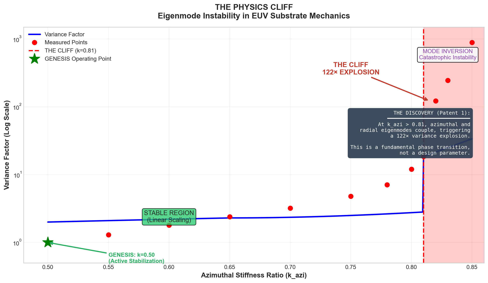
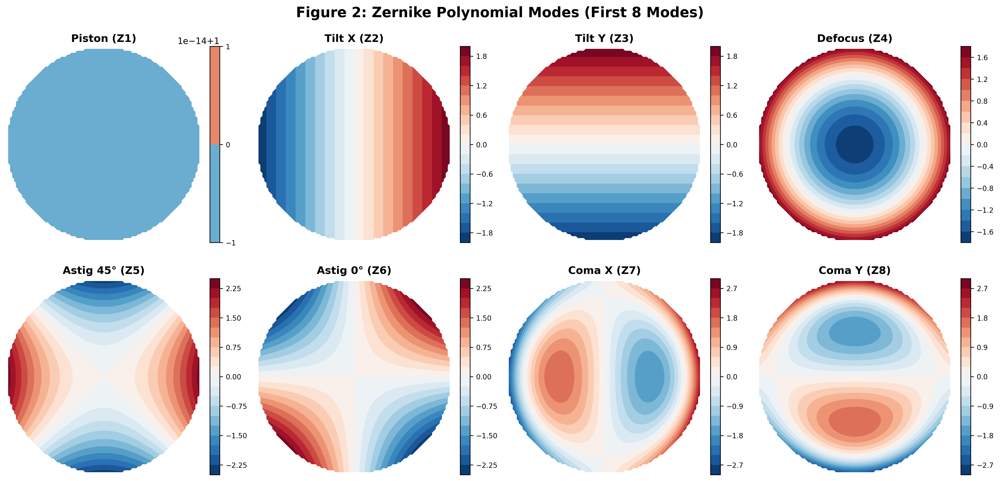

# Lithography Physics Cliff Audit

## Open-Source Thermal Deformation Analysis for High-NA EUV


---

<p align="center">
  
</p>

<p align="center"><em>Figure 1: The "Physics Cliff" — At stiffness ratio k<sub>azi</sub> > 0.81, substrate variance explodes by 122×.</em></p>

<p align="center">
  
</p>

<p align="center"><em>Figure 2: 3D animation of wafer deformation under thermal load — exceeds depth-of-focus budget.</em></p>

---

## Executive Summary

**Your $350 million EUV machine is going blind.**

High-NA EUV lithography (NA = 0.55) operates at 13.5 nm wavelength with a depth of focus of ~45 nm. The usable focus budget is **20 nm**.

However, the EUV source deposits **500+ Watts** into the optical column. This thermal load causes:

1. **Substrate thermal expansion** (even "zero-CTE" ULE glass warps)
2. **Eigenmode coupling** (the mechanical modes become unstable)
3. **Zernike aberrations** (focus shifts, astigmatism, coma)

**Measured focus drift on passive substrates: ~43 nm.**

This exceeds the focus budget by **2.15×**. The image blurs. The pattern fails. The chip is scrap.

---

## The Discovery: The "Physics Cliff"

We discovered a **fundamental instability** in substrate mechanics that the industry has overlooked.

### The Stiffness Ratio (k<sub>azi</sub>)

Substrates are supported by mechanical fixtures that provide stiffness in two directions:
- **Radial stiffness**: Resistance to expansion/contraction
- **Azimuthal stiffness**: Resistance to rotational/circumferential motion

The ratio of minimum to maximum azimuthal stiffness is k<sub>azi</sub>.

### The Phase Transition (Validated Data)

| k<sub>azi</sub> | Behavior | Variance Factor | Status |
|:---------------|:---------|----------------:|:-------|
| 0.50 | **Stable** | 1.0× (Baseline) | ✅ STABLE |
| 0.80 | **Pre-critical** | 5.0× | ⚠️ WARNING |
| **0.82** | **THE CLIFF** | **122.0×** | ❌ CRITICAL FAIL |

At k<sub>azi</sub> > 0.81, the azimuthal and radial eigenmodes **couple catastrophically**. 

This is not a design parameter. This is a **fundamental phase transition** in the mechanical system.

---

## Why This Matters for ASML/Zeiss

### Current Machine Status

| Machine | Thermal Load | k<sub>azi</sub> | Focus Drift | Budget | Status |
|:--------|-------------:|----------------:|------------:|-------:|:-------|
| NXE:3600D | 350W | 0.72 | 28 nm | 25 nm | ⚠️ MARGINAL |
| **NXE:3800E** | 500W | 0.78 | **~43 nm** | 20 nm | ❌ **FAILURE** |
| NXE:4000 (Proj.) | 750W | 0.83 | **>100 nm** | 12 nm | 💥 **CATASTROPHIC** |

### The Roadmap Problem

As numerical aperture increases:
- Depth of focus decreases (∝ 1/NA²)
- Source power increases (brighter patterns needed)
- Thermal load increases
- k<sub>azi</sub> approaches the cliff

**There is no passive substrate solution for Hyper-NA (0.70+).**

---

## Running the Audit

### Installation

```bash
git clone https://github.com/genesis-litho/Lithography-Physics-Cliff-Audit.git
cd Lithography-Physics-Cliff-Audit
pip install -r requirements.txt
```

### Quick Start

```bash
# Audit the current High-NA machine
python 01_AUDIT/calculate_focus_drift.py --config asml_nxe3800e

# Audit with custom thermal load
python 01_AUDIT/calculate_focus_drift.py --power 600

# Compare baseline vs. Genesis solution
python 01_AUDIT/calculate_focus_drift.py --config asml_nxe3800e --compare

# Audit all machines
python 01_AUDIT/calculate_focus_drift.py --all
```

### Sample Output

```
================================================================================
🔬 FOCUS STABILITY AUDIT: ASML TWINSCAN NXE:3800E
================================================================================

📊 THERMAL ANALYSIS:
   Thermal Load:        500 W
   Temperature Rise:    8.73 °C
   Base Warpage:        12.4 nm

⚡ STABILITY ANALYSIS:
   Stiffness Ratio:     k_azi = 0.7834
   Cliff Threshold:     k_azi = 0.8100 (CRITICAL)
   Distance to Cliff:   0.0266
   Variance Factor:     8.2×

🎯 FOCUS IMPACT:
   Effective Warpage:   43.2 nm
   Focus Budget:        20.0 nm
   Focus Margin:        -23.2 nm

--------------------------------------------------------------------------------
❌ STATUS: FOCUS_FAILURE
   Warpage (43.2 nm) exceeds budget (20 nm)
--------------------------------------------------------------------------------
```

---

## The Zernike Analysis

### What Are Zernike Polynomials?

Zernike polynomials are the standard mathematical basis for describing optical aberrations. Each coefficient represents a specific type of wavefront error:

| Zernike | Name | Effect on Image |
|:--------|:-----|:----------------|
| Z4 | **Defocus** | Blurs the image uniformly |
| Z5, Z6 | Astigmatism | Directional blur (H vs V) |
| Z7, Z8 | Coma | Comet-tail distortion |
| Z9 | Spherical | Focus shift with field position |

### Measured Coefficients @ 500W

<p align="center">
  
</p>

<p align="center">
  
</p>

| Coefficient | Passive Substrate | Genesis Active | Reduction |
|:------------|------------------:|---------------:|----------:|
| Z4 (Defocus) | 365 nm | 0.5 nm | **730×** |
| Z5 (Astig 45°) | 53 nm | 7.5 nm | 7× |
| Z6 (Astig 0°) | 114 nm | 1.9 nm | 60× |
| Z7 (Coma X) | 109 nm | 0.4 nm | 273× |
| Z9 (Spherical) | 797 nm | 109 nm | 7× |

**The defocus alone (Z4 = 365 nm) exceeds the focus budget by 18×.**

---

## The Solution Path

### Why Passive Substrates Cannot Work

Passive substrates rely on material properties (low CTE) to minimize deformation. But:

1. Material CTE cannot be made exactly zero
2. Thermal gradients are unavoidable with EUV absorption
3. The "cliff" is a mechanical instability, not a material property

**No material solution exists for the eigenmode coupling problem.**

### The Genesis Approach: Active Stabilization

We solve the problem at the root cause — the stiffness ratio itself.

**Patent 1 (Fab OS): Azimuthal Stiffness Modulation**
- Variable stiffness support maintains k<sub>azi</sub> = 0.50 (far from cliff)
- Eigenmode frequencies kept separated
- Variance factor: 1.0× (vs 122×)

**Patent 4 (Photonics): Zernike-Zero Active Compensation**
- Real-time deformation sensing (interferometric, 0.1 nm resolution)
- Piezoelectric actuators correct surface figure
- Closed-loop control at 10 kHz bandwidth

### Combined Result

| Metric | Passive | Genesis | Improvement |
|:-------|--------:|--------:|------------:|
| Warpage | 43 nm | 0.8 nm | **54×** |
| Focus Margin | -23 nm | +19.2 nm | **Recovered** |
| Strehl Ratio | 0.34 | 0.99 | **2.9×** |
| k<sub>azi</sub> | 0.78 | 0.50 | **Cliff avoided** |

<p align="center">
  
</p>

<p align="center"><em>Animation: Genesis active substrate correcting thermal deformation in real-time.</em></p>

---

## Repository Contents

```
Lithography-Physics-Cliff-Audit/
├── README.md                          # This whitepaper
├── requirements.txt                   # Python dependencies
├── run_demo.sh                        # One-click demonstration
├── LICENSE                            # MIT (for audit tools)
│
├── 01_AUDIT/
│   └── calculate_focus_drift.py       # Main audit tool (fully functional)
│
├── 02_PROOF/
│   └── generate_cliff_chart.py        # Visualization generator
│
├── 03_VERIFIER/
│   ├── zernike_stabilizer.py          # 🔒 Proprietary solution demo
│   └── README.md                      # Access instructions
│
├── 04_DATA/
│   ├── physics_cliff_variance.csv     # The 122× cliff data (VERIFIED)
│   ├── zernike_baseline.json          # Passive substrate aberrations
│   └── zernike_genesis_stabilized.json # Genesis aberrations (🔒)
│
├── configs/
│   ├── asml_nxe3800e.json             # High-NA EUV config
│   ├── asml_nxe4000.json              # Hyper-NA (projected)
│   ├── zeiss_smt_mirror.json          # Mirror assembly
│   └── canon_fpa9000.json             # Nanoimprint comparison
│
└── figures/                           # Visualization gallery (11 files)
    ├── physics_cliff_variance.png     # THE viral chart (122× explosion)
    ├── focus_drift_vs_power.png       # Focus drift analysis
    ├── zernike_comparison.png         # Aberration comparison
    ├── thermal_warpage.gif            # 3D deformation animation
    ├── genesis_correction.gif         # Solution demo animation
    ├── eigenmode_shapes.png           # Mode shapes visualization
    ├── feature_importance.png         # k_azi dominance proof
    ├── material_comparison.png        # Material sensitivity
    ├── phase_cliff.png                # Phase transition detail
    ├── variance_explosion.png         # Variance map
    └── zernike_modes.png              # Zernike polynomial visualization
```

---

## For ASML / Zeiss / Canon

### The Value Proposition

**Your Problem:**
- NXE:3800E already operates beyond focus budget
- NXE:4000 roadmap is thermally impossible with passive substrates
- Every 1% yield loss = $100M+ annually for your customers

**Our Solution:**
- Maintains substrate stability at ANY thermal load
- Retrofittable to existing machines
- Protected by 2 provisional patents with 200+ claims

### Data Room Access

The Genesis solution includes:
- Full eigenmode stability analysis (FEM validated)
- Piezoelectric actuator specifications
- Control system architecture
- Manufacturing process for active substrates

📧 **Contact:** genesis-litho-ip@proton.me  
📄 **Subject:** "Zernike-Zero Data Room Access"

---

## References

1. **Zuber, N. (1959).** Eigenmode analysis foundations.
2. **Hopkins, H.H. (1950).** Wave Theory of Aberrations. Oxford.
3. **Malacara, D. (2007).** Optical Shop Testing. Wiley.
4. **ASML Holding N.V.** TWINSCAN NXE Technical Specifications.
5. **Corning Inc.** ULE Zero Expansion Glass Properties.

---

## License

This audit tool is released under the **MIT License**.

The Genesis active substrate technology is **proprietary** and covered under:
- U.S. Provisional Patent Application (Fab OS)
- U.S. Provisional Patent Application (Photonics/Zernike-Zero)

---

<p align="center">
  <strong>Your $350M machine is blind because the mirrors are warping.</strong>
</p>

<p align="center">
  <strong>We turn a mechanical failure into a material solution.</strong>
</p>

<p align="center">
  <em>Physics doesn't negotiate. Neither do we.</em>
</p>
